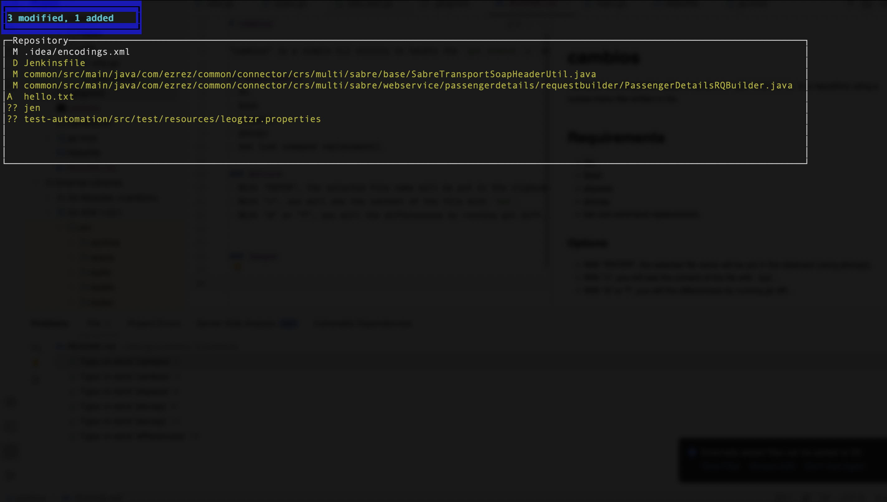

# cambios

"cambios" is a simple CLI utility to handle the `git status -s` in a repository using a _curses_ menu like written in Go.

## Requirements
- Go.
- Bash
- pbpaste
- pbcopy
- bat (cat command replacement).

### Options
- With "ENTER", the selected file name will be put in the clipboard (using pbcopy).
- With "v", you will see the content of the file with `bat`.
- With "d" or "f", you will the differencess by running git diff...

## Usage
Run the `cambios.sh` directory and pass the Git repository path:

`
./cambios.sh ~/dev/repos/dev 
`

### Images

